<!-- MATRIX HEADER -->
<p align="center">
  
</p>

<p align="center">
  
</p>

<p align="center">
  <a href="#-red-pill-deep-dive"></a>
  <a href="#-blue-pill-quick-view"></a>
</p>

<p align="center"> <sub style="color:#00ff41;">Signal acquired. Profile modules online.</sub> </p> ```

---


## 🔵 Blue Pill (Quick View)
<table>
  <tr>
    <td width="52%" valign="top">
    Links

Portfolio: (add)

LinkedIn: (add)

Email: (optional)

</td> <td width="48%" valign="top">
> system.stats
  </td> </tr> <tr> <td width="52%" valign="top">
> featured.projects
 <!-- Add more pins if you want:  --> </td> <td width="48%" valign="top">
> activity.feed
 </td> </tr> </table>

🔴 Red Pill (Deep Dive)
> toolbox


> matrix.snake


### > about.me
```txt
Name: Bhavesh Komuravelli
Location: Australia
Focus: Building Toddledo (APAC childcare SaaS)
Style: Clean UI, automation, data, systems thinking


